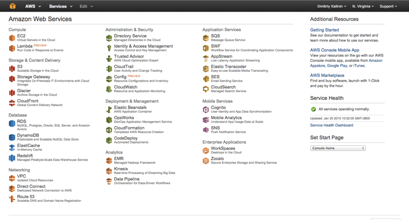
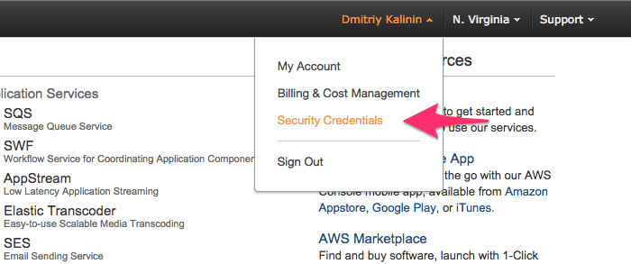
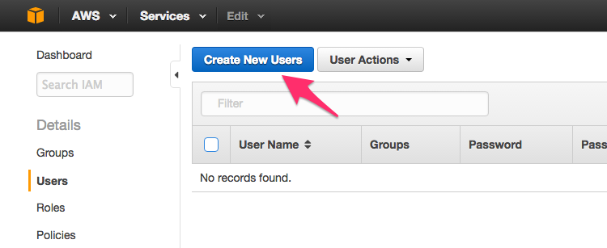
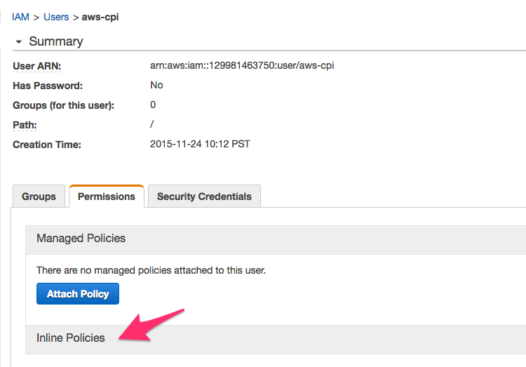
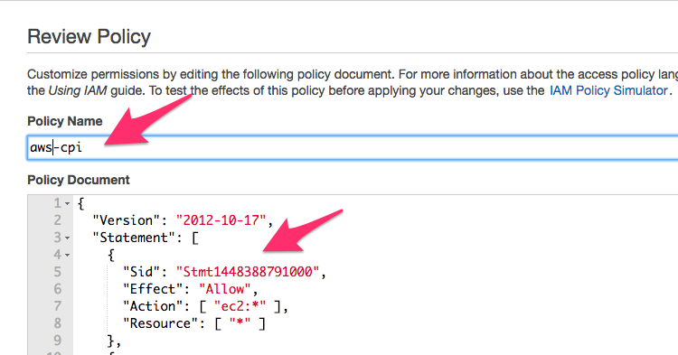

## Creating new IAM user 

1. Log into the AWS console: [https://console.aws.amazon.com/console/home](https://console.aws.amazon.com/console/home).

    

1. Click your account name and select **Security Credentials**.

    

1. If the AWS IAM confirmation box is presented, click **Get Started with IAM Users** to go to IAM Users management page. Alternatively go directly to [users list](https://console.aws.amazon.com/iam/home#users).

    

1. Click **Create New Users** button.

    

1. Enter a descriptive name for a new user, make sure that access keys will be generated for each user and click **Create** button.

    

1. Record **Access Key ID** and **Secret Access Key** for later use. Click **Close** link to get back to the list of users.

    

1. Click on a new user from the list of users.

1. Click on **Inline Policies** panel and choose to create a new inline policy.

    

1. Choose **Custom Policy**.

1. Add a policy configuration for the chosen user and click **Apply Policy**.

    

    The CPI provides a [sample policy](https://github.com/cloudfoundry-incubator/bosh-aws-cpi-release/blob/master/docs/iam-policy.json) which supports all functionality provided by the CPI. Please review the policy to further limit unnecessary access for your environment.
