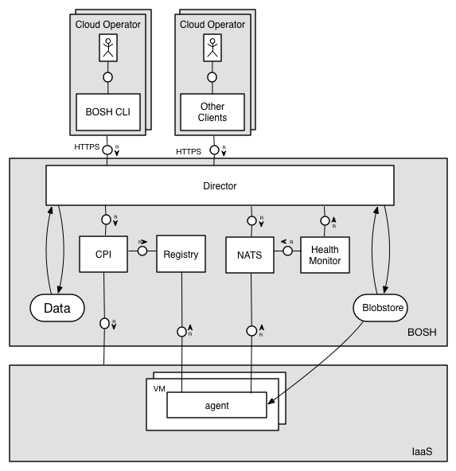

Before creating a new [environment](terminology.md#environment) we recommend to learn the names of major components that will be installed, used and configured:

---
## Command Line Interface (CLI) {: #cli }

The Command Line Interface (CLI) is the primary operator interface to BOSH. An operator uses the CLI to interact with the Director and perform actions on the cloud.

CLI is typically installed on a machine that can directly communicate with the Director's API, e.g. an operator's laptop, or a jumpbox in the datacenter.

---
## Director {: #director }

The Director is the core orchestrating component in BOSH. The Director controls VM creation and deployment, as well as other software and service lifecycle events.

The Director creates actionable tasks:

* By translating commands sent by an operator through the CLI
* From scheduled processes like backups or snapshots
* If needed to reconcile the expected state with the actual state of a VM

Once created, the Director adds these tasks to the Task Queue. Worker processes take tasks from the Task Queue and act on them.

### Task Queue {: #queue }

An asynchronous queue used by the Director and Workers to manage tasks. The Task Queue resides in the Database.

### Workers {: #workers }

Director workers take tasks from the Task Queue and act on them.

### Cloud Provider Interface (CPI) {: #cpi }

A Cloud Provider Interface (CPI) is an API that the Director uses to interact with an IaaS to create and manage stemcells, VMs, and disks. A CPI abstracts infrastructure differences from the rest of BOSH.

---
## Health Monitor {: #health-monitor }

The Health Monitor uses status and lifecycle events received from Agents to monitor the health of VMs. If the Health Monitor detects a problem with a VM, it can send an alert through notification plugins, or trigger the Resurrector.

### Resurrector {: #resurrector }

If enabled, the Resurrector plugin automatically recreates VMs identified by the Health Monitor as missing or unresponsive. It uses same Director API that CLI uses.

---
## DNS Server {: #dns }

BOSH uses PowerDNS to provide DNS resolution between the VMs in a deployment.

---
## Components used to store Director's persistent data {: #persistent }

### Database {: #database }

The Director uses a Postgres database to store information about the desired state of a deployment. This includes information about stemcells, releases, and deployments.

### Blobstore {: #blobstore }

The Blobstore stores the source forms of releases and the compiled images of releases. An operator uploads a release using the CLI, and the Director inserts the release into the Blobstore. When you deploy a release, BOSH orchestrates the compilation of packages and stores the result in the Blobstore.

---
## Agent {: #agent }

BOSH includes an Agent on every VM that it deploys. The Agent listens for instructions from the Director and carries out those instructions. The Agent receives job specifications from the Director and uses them to assign a role, or Job, to the VM.

For example, to assign the job of running MySQL to a VM, the Director sends instructions to the Agent on the VM. These instructions include which packages to install and how to configure those packages. The Agent uses these instructions to install and configure MySQL on the VM.

---
## Components used for cross-component communication {: #comm }

### Message Bus (NATS) {: #nats }

The Director and the Agents communicate through a lightweight publish-subscribe messaging system called NATS. These messages have two purposes: to perform provisioning instructions on the VMs, and to inform the Health Monitor about changes in the health of monitored processes.

### Registry {: #registry }

!!! note
    As of CPI V2, the registry may be avoided if the stemcell API version is sufficient. See [CPI API V2](cpi-api-v2.md) and [CPI V2 Migration Guide](v2-migration-guide.md) for more information on how the CPI, Agent, and Director behave in a registry-less environment.

When the Director creates or updates a VM, it stores configuration information for the VM in the Registry so that it can be used during bootstrapping stage of the VM.

---
## Example component interaction {: #example }

This example shows how components interact when creating a new VM.

### Creating a new VM with Registry {: #create-vm }

1. Through the CLI, the operator takes an action (e.g. deploy for the first time, scaling up deployment) which requires creating a new VM.
1. The CLI passes the instruction to the Director.
1. The Director uses the CPI to tell the IaaS to launch a VM.
1. The IaaS provides the Director with information (IP addresses and IDs) the Agent on the VM needs to configure the VM.
1. The Director uses CPI to update the Registry with the configuration information for the VM.
1. The Agent running on the VM requests the configuration information for the VM from the Registry.
1. The Registry responds with the IP addresses and IDs.
1. The Agent uses the IP addresses and IDs to configure the VM.

### Creating a new VM without Registry {: #create-vm-v2 }

1. Through the CLI, the operator takes an action (e.g. deploy for the first time, scaling up deployment) which requires creating a new VM.
1. The CLI passes the instruction to the Director.
1. The Director uses the CPI to tell the IaaS to launch a VM.
1. The IaaS provides the Director with information (IP addresses and IDs) the Agent on the VM needs to configure the VM.
1. The Director updates the Agent running on the VM with the IP addresses and IDs.
1. The Agent uses the IP addresses and IDs to configure the VM.
