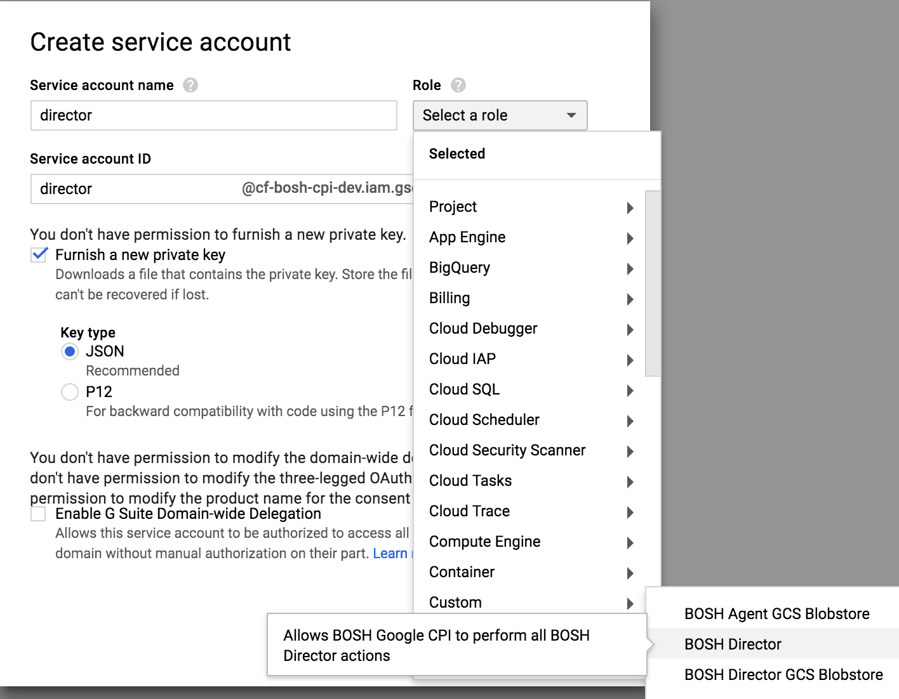

This topic describes how to configure BOSH with the minimum set of permissions on Google Cloud Engine.

## Google CPI and Director {: #bosh-director }

This section will guide you through how to configure the Google Cloud CPI and Director with the default blobstore.

!!! note
    If you wish to configure BOSH to use GCS blobstore also follow [these steps](google-required-permissions.md#director-with-gcs-blobstore)

1. Download and install the [Google Cloud CLI](https://cloud.google.com/sdk/) and [BOSH CLI v2](cli-v2.md#install).

2. Create a file called `bosh-director-role.yml`.

    ```yaml
    title: BOSH Director
    stage: BETA
    description: Allows BOSH Google CPI to perform all BOSH Director actions
    name: projects/((project_id))/roles/bosh.director
    included_permissions:
    # addresses
    - compute.addresses.get
    - compute.addresses.list

    # backend services
    - compute.backendServices.get
    - compute.backendServices.list

    # disk types
    - compute.diskTypes.get

    # disks
    - compute.disks.delete
    - compute.disks.list
    - compute.disks.get
    - compute.disks.createSnapshot
    - compute.snapshots.create
    - compute.disks.create
    - compute.images.useReadOnly

    # global operations
    - compute.globalOperations.get
    # images
    - compute.images.delete
    - compute.images.get
    - compute.images.create

    # instance groups
    - compute.instanceGroups.get
    - compute.instanceGroups.list
    - compute.instanceGroups.update

    # instances
    - compute.instances.setMetadata
    - compute.instances.setLabels
    - compute.instances.setTags
    - compute.instances.reset
    - compute.instances.start
    - compute.instances.list
    - compute.instances.get
    - compute.instances.delete
    - compute.instances.create
    - compute.subnetworks.use
    - compute.subnetworks.useExternalIp
    - compute.instances.detachDisk
    - compute.instances.attachDisk
    - compute.disks.use
    - compute.instances.deleteAccessConfig
    - compute.instances.addAccessConfig
    - compute.addresses.use

    # machine type
    - compute.machineTypes.get

    # region operations
    - compute.regionOperations.get

    # zone operations
    - compute.zoneOperations.get

    # networks
    - compute.networks.get

    # subnetworks
    - compute.subnetworks.get

    # snapshots
    - compute.snapshots.delete
    - compute.snapshots.get

    # target pool
    - compute.targetPools.list
    - compute.targetPools.get
    - compute.targetPools.addInstance
    - compute.targetPools.removeInstance
    - compute.instances.use

    # Storage services - used when uploading heavy stemcells
    - storage.buckets.create
    - storage.objects.create
    ```

3. Create the BOSH Director role:

    ```shell
    gcloud beta iam roles --project <project-id> create bosh.director \
      --file <( bosh int -v project_id=<project-id> bosh-director-role.yml )
    ```

4. On Google Cloud navigate go to `IAM & admin` > `Service accounts` and click on `CREATE SERVICE ACCOUNT`.
   Give your service account a name, check `Furnish a new private key` and select the aforementioned role.

   


## Minimum permissions for GCS blobstore {: #director-with-gcs-blobstore }

In addition to configuring the Google CPI and Director with the previous permissions, in order to allow them to use GCS blobstore you need to grant additional permissions.

!!! note
    We highly recommend creating separate service accounts.

This configuration is similar to the previous one except that it's used when the Director and the Agents use GCS as their [blobstore](bosh-components.md#blobstore) instead of an internal blobstore provided by the bosh release.

1. Download and install the [Google Cloud CLI](https://cloud.google.com/sdk/) and [BOSH CLI v2](cli-v2.md#install).

2. Create a file called `director-blobstore-role.yml`.

    ```yaml
    title: BOSH Director GCS Blobstore
    stage: BETA
    description: Allows BOSH Director GCS Blobstore client to perform necessary operations to the blobstore
    name: projects/((project_id))/roles/blobstore.director
    included_permissions:
    - storage.buckets.get
    - storage.objects.get
    - storage.objects.create
    - storage.objects.delete
    ```

    and `agent-blobstore-role.yml`.

    ```yaml
    title: BOSH Agent GCS Blobstore
    stage: BETA
    description: Allows BOSH Agent GCS Blobstore client to perform necessary operations to the blobstore
    name: projects/((project_id))/roles/blobstore.agent
    included_permissions:
    - storage.buckets.get
    - storage.objects.get
    - storage.objects.create
    ```

    !!! note
        The agent does not need to delete files from the blobstore

4. Configure roles.

    ```shell
    gcloud beta iam roles --project <project-id> create blobstore.director \
      --file <( bosh int -v project_id=<project-id> director-blobstore-role.yml )

    gcloud beta iam roles --project <project-id> create blobstore.agent \
      --file <( bosh int -v project_id=<project-id> agent-blobstore-role.yml )
    ```

5. On Google Cloud navigate go to `IAM & admin` > `Service accounts` and click on `CREATE SERVICE ACCOUNT`.
   Give your service account a name, check `Furnish a new private key` and select the aforementioned roles.

   

6. Configure [GCS Blobstore](director-configure-blobstore.md#gcs)
