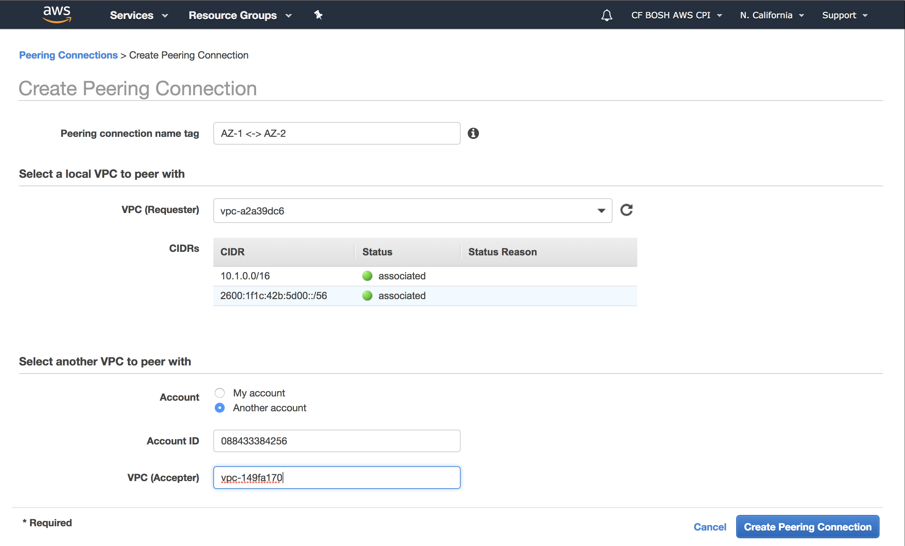
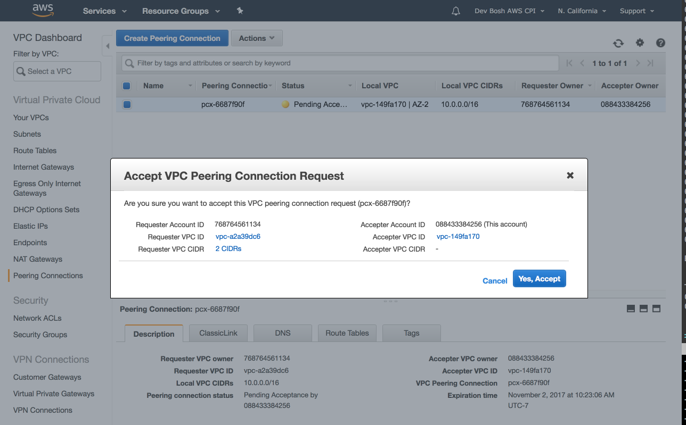
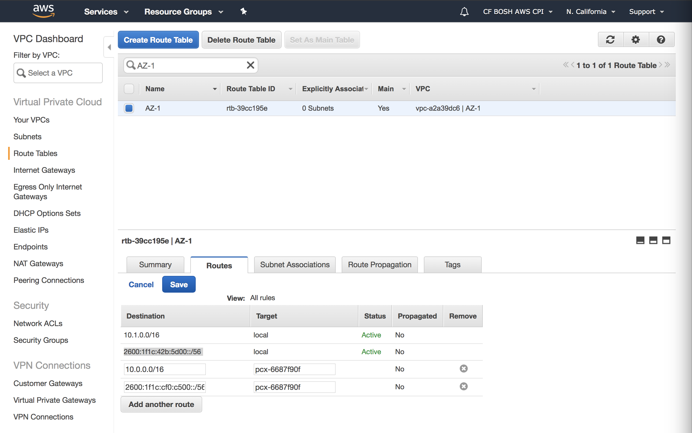
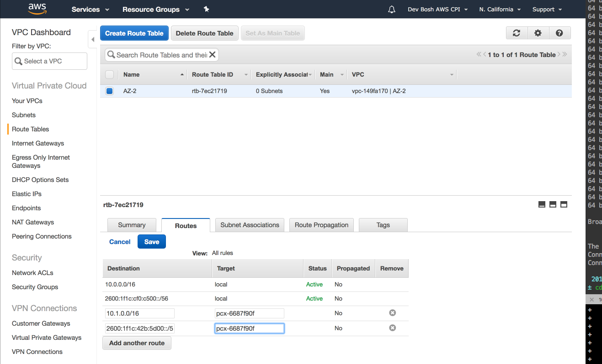

!!! note
    BOSH supports Multi-CPI since version v261+.

In this guide we explore how to configure BOSH to deploy VMs from a single deployment across two different regions in two separate AWS Accounts. Communication between regions will be configured via VPC Peering or through a VPN using IPSec.

For simplicity reasons we're going to allow all internal traffic between two VPCs, however this can be configured as desired by the operator.

---
## Set up the IaaS {: #setup-iaas }

Let's start by initializing main AZ (`z1`) to US East (N. Virginia) by following steps 1 and 2 from [Creating environment on AWS](init-aws.md). This will give you a working BOSH Director in a single region. You can perform a deployment to test Director is working fine.

To add a second AZ (`z2`) to US West (N. California) you need to perform step 1 from [Creating environment on AWS](init-aws.md) in another AWS account.

---
## Connecting VPCs {: #connecting-vpcs }

The VMs in one AZ need to be able to talk to VMs in the other AZ. We're going to describe two ways AZs can be connected. You have two options:

- if VPCs are in the same AWS region you can simply use [VPC Peering](guide-multi-cpi-aws.md#vpc-peering) as shown below

- if VPCs are in different regions you will need to connect them through a [OpenVPN](guide-multi-cpi-aws.md#openvpn) as shown below

- if VPCs are spread out across multiple regions, you can mix and match two approaches above

---
### VPC Peering (only works for VPCs in the same region) {: #vpc-peering }

To connect VPCs in the same region you have to create a VPC Peering Connection between each region. In our case, we have two VPCs so only one connection is required.

1. Create new VPC Peering Connection as shown in the image:

    

1. From the Accepter VPC Account go into the console and click Accept Request. After accepting the request it will recommend you to edit the route tables from each VPC to allow traffic between them through the peering connection.

    

1. Modify VPC Route Table in each VPC and add other VPC's CIDR block with the VPC Peering Connection as the target.

    For `z1`:

    

    For `z2`:

    

!!! note
    If you want IPv6 traffic to be routed you also need to add the corresponding IPv6 CIDR blocks.

---
### OpenVPN using IPSec {: #openvpn }

Here we are going to use the [OpenVPN BOSH Release](https://github.com/dpb587/openvpn-bosh-release) to connect both OpenVPN Server and client in each region like shown below:


0. Setup local Multi-CPI directories:

    ```shell
    $ mkdir -p ~/workspace/multi-cpi-vpn
    $ cd ~/workspace
    # Clone OpenVPN BOSH Release
    $ git clone git@github.com:dpb587/openvpn-bosh-release.git
    # Clone Multi-CPI Knowledge-Base
    $ git clone git@github.com:cdutra/bosh-multi-cpi-kb.git
    $ cd multi-cpi-vpn
    ```

0. Allocate Elastic IPs for each VPN Server in their respective regions.

0. Create following files `~/workspace/multi-cpi-vpn/creds-az1.yml` and `~/workspace/multi-cpi-vpn/creds-az2.yml` with the following properties. You should have all this information from the above [Set up the IaaS](guide-multi-cpi-aws.md#setup-iaas) step.

    ```yaml
    access_key_id: <aws-access-key-id>
    secret_access_key: <aws-secret-access-key>
    region: <aws-region>
    availability_zone: <aws-availability-zone>
    subnet_id: <subnet-id>
    wan_ip: <aws-elastic-public-ip> # Used by OpenVPN Server
    default_security_groups: <security-group-name>
    bootstrap_ssh_key_name: <ssh-key-name>
    bootstrap_ssh_key_path: <ssh-private-key>
    route_table_id: <aws-route-table-id> # e.g. rtb-4127673b
    ```

0. Generate certificates for each server and client.

    ```shell
    $ bosh int ~/workspace/bosh-multi-cpi-kb/templates/vpn-ca.yml \
      -l ~/workspace/multi-cpi-vpn/creds-az1.yml \
      --vars-store=~/workspace/multi-cpi-vpn/certs-vpn-az1.yml

    $ bosh int ~/workspace/bosh-multi-cpi-kb/templates/vpn-ca.yml \
      -l ~/workspace/multi-cpi-vpn/creds-az2.yml \
      --vars-store=~/workspace/multi-cpi-vpn/certs-vpn-az2.yml
    ```

0. Deploy OpenVPN Servers in each AZ.

    ```shell
    # Create VPN server in z1
    $ bosh create-env \
      --vars-store ~/workspace/multi-cpi-vpn/certs-vpn-az1.yml \
      --state ./openvpn-az1-state.json \
      -o ~/workspace/openvpn-bosh-release/deployment/init-aws.yml \
      -o ~/workspace/openvpn-bosh-release/deployment/with-pushed-routes.yml \
      -o ~/workspace/bosh-multi-cpi-kb/templates/vpn-server-ops.yml \
      -o ~/workspace/bosh-multi-cpi-kb/templates/vpn-client-ops.yml \
      -l ~/workspace/multi-cpi-vpn/creds-az1.yml \
      -v server_key_pair=$( bosh int ~/workspace/multi-cpi-vpn/certs-vpn-az1.yml --path /server_key_pair ) \
      -v push_routes=["10.0.0.0 255.255.255.0"] \
      -v lan_gateway=10.0.0.1 \
      -v lan_ip=10.0.0.7 \
      -v lan_network=10.0.0.0 \
      -v lan_network_mask_bits=24 \
      -v vpn_network=192.168.0.0 \
      -v vpn_network_mask=255.255.255.0 \
      -v vpn_network_mask_bits=24 \
      -v remote_network_cidr_block=10.0.1.0/24 \
      -v remote_vpn_ip=<az2-vpn-external-ip> \
      -v client_key_pair=$( bosh int ~/workspace/multi-cpi-vpn/certs-vpn-az2.yml --path /client_key_pair ) \
      ~/workspace/openvpn-bosh-release/deployment/openvpn.yml

    # Create VPN server in z2
    $ bosh create-env \
      --vars-store ~/workspace/multi-cpi-vpn/certs-vpn-az2.yml \
      --state ./openvpn-az2-state.json \
      -o ~/workspace/openvpn-bosh-release/deployment/init-aws.yml \
      -o ~/workspace/openvpn-bosh-release/deployment/with-pushed-routes.yml \
      -o ~/workspace/bosh-multi-cpi-kb/templates/vpn-server-ops.yml \
      -o ~/workspace/bosh-multi-cpi-kb/templates/vpn-client-ops.yml \
      -l ~/workspace/multi-cpi-vpn/creds-az2.yml \
      -v server_key_pair=$( bosh int ~/workspace/multi-cpi-vpn/certs-vpn-az2.yml --path /server_key_pair ) \
      -v push_routes=["10.0.1.0 255.255.255.0"] \
      -v lan_gateway=10.0.1.1 \
      -v lan_ip=10.0.1.7 \
      -v lan_network=10.0.1.0 \
      -v lan_network_mask_bits=24 \
      -v vpn_network=192.168.1.0 \
      -v vpn_network_mask=255.255.255.0 \
      -v vpn_network_mask_bits=24 \
      -v remote_network_cidr_block=10.0.0.0/24 \
      -v remote_vpn_ip=<az1-vpn-external-ip> \
      -v client_key_pair=$( bosh int ~/workspace/multi-cpi-vpn/certs-vpn-az1.yml --path /client_key_pair ) \
      ~/workspace/openvpn-bosh-release/deployment/openvpn.yml
    ```

---
## Configure CPI and Cloud configs {: #configuring-configs }

Now that the IaaS is configured, update your Director's [CPI config](cpi-config.md):

```yaml
cpis:
- name: aws-us-east
  type: aws
  properties:
    access_key_id: ((az1_access_key_id))
    secret_access_key: ((az1_secret_access_key))
    default_key_name: az-1
    default_security_groups:
    - ((az1_security_group))
    region: us-east-1
- name: aws-us-west
  type: aws
  properties:
    access_key_id: ((az2_access_key_id))
    secret_access_key: ((az2_secret_access_key))
    default_key_name: az-2
    default_security_groups:
    - ((az2_security_group))
    region: us-west-1
```

```shell
$ bosh update-cpi-config cpi.yml
```

And cloud config:

!!! note
    The `azs` section of your `cloud-config` now contains the `cpi` key with available values that are defined in your `cpi-config`.

```yaml
azs:
- name: z1
  cpi: aws-us-east
  cloud_properties:
    availability_zone: us-east-1a
- name: z2
  cpi: aws-us-west
  cloud_properties:
    availability_zone: us-west-1a

networks:
- name: default
  type: manual
  subnets:
  - az: z1
    range: 10.0.0.0/24
    gateway: 10.0.0.1
    reserved: [10.0.0.2-10.0.0.9]
    cloud_properties:
      subnet: subnet-f529c6da
  - az: z2
    range: 10.0.1.0/24
    gateway: 10.0.1.1
    reserved: [10.0.1.2-10.0.1.9]
    cloud_properties:
      subnet: subnet-452ec16a

vm_types:
- name: default
  cloud_properties:
    instance_type: t2.medium

compilation:
  az: z1
  network: private
  reuse_compilation_vms: true
  vm_type: default
  workers: 1
```

```shell
$ bosh update-cloud-config cloud.yml
```

---
## Deploy example Zookeeper deployment {: #deploying }

...
