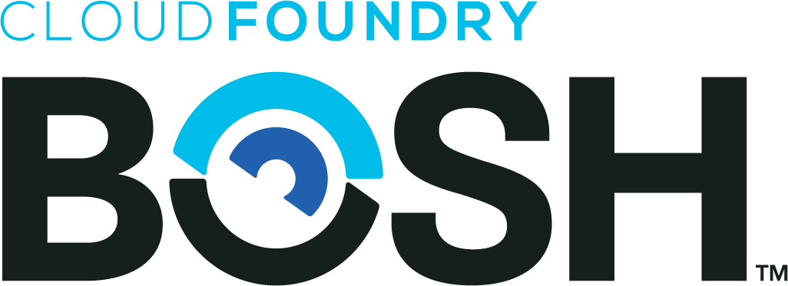

# Welcome to

BOSH is a project that unifies release engineering, deployment, and lifecycle management of small and large-scale cloud software. BOSH can provision and deploy software over hundreds of VMs. It also performs monitoring, failure recovery, and software updates with zero-to-minimal downtime.

While BOSH was developed to deploy Cloud Foundry PaaS, it can also be used to deploy almost any other software (Hadoop, for instance). BOSH is particularly well-suited for large distributed systems. In addition, BOSH supports multiple Infrastructure as a Service (IaaS) providers like VMware vSphere, Google Cloud Platform, Amazon Web Services EC2, and OpenStack. There is a Cloud Provider Interface (CPI) that enables users to extend BOSH to support additional IaaS providers such as Apache CloudStack and VirtualBox.

## Downloads

### CLI

The [`bosh` CLI](cli-v2.md) is the command line tool used for interacting with all things BOSH. See [Installation](cli-v2-install.md) for more details.

| Operating System | Binary (SHA1) |
| --------------- | --------------- |
| Darwin / macOS  | [bosh-cli-3.0.1-darwin-amd64](https://s3.amazonaws.com/bosh-cli-artifacts/bosh-cli-3.0.1-darwin-amd64) (`d2fea20210a47b8c8f1f7dbb27ffb5808d47ce87`) |
| Linux           | [bosh-cli-3.0.1-linux-amd64](https://s3.amazonaws.com/bosh-cli-artifacts/bosh-cli-3.0.1-linux-amd64) (`ccc893bab8b219e9e4a628ed044ebca6c6de9ca0`) |
