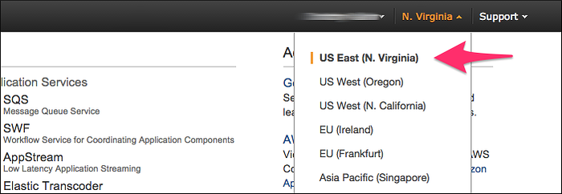
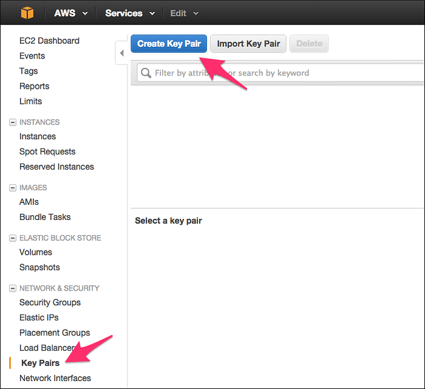
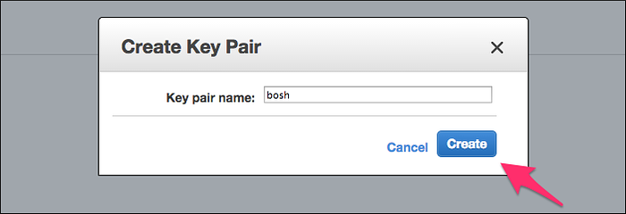

This document shows how to set up new [environment](terminology.md#environment) on Amazon Web Services (AWS).

## Step 1: Prepare an AWS Account {: #prepare-aws }

If you do not have an AWS account, [create one](http://goo.gl/MaAybK).

To configure your AWS account:

* [Obtain AWS credentials](#credentials)
* [Create a Virtual Private Cloud (VPC)](#create-vpc)
* [Create an Elastic IP](#create-eip)
* [Create a Key Pair](#create-key-pair)
* [Create and Configure Security Group](#create-security)

---
### Obtain AWS Credentials {: #credentials }

Your AWS credentials consist of an Access Key ID and a Secret Access Key. Follow [Creating IAM Users](aws-iam-users.md#create) to create a new IAM user.

---
### Create a Virtual Private Cloud (VPC) {: #create-vpc }

1. In the upper-right corner of the AWS Console, select a Region.

    

1. On the AWS Console, select **VPC** to get to the VPC Dashboard.

    

1. Click **Start VPC Wizard**.

    

1. Select **VPC with a Single Public Subnet** and click **Select**.

1. Complete the VPC form with the following information:
    * **IP CIDR block**: 10.0.0.0/16
    * **VPC name**: bosh
    * **Public subnet**: 10.0.0.0/24
    * **Availability Zone**: us-east-1a
    * **Subnet name**: public
    * **Enable DNS hostnames**: Yes
    * **Hardware tenancy**: Default

    

1. Click **Create VPC** and click **OK** once VPC is successfully created.

1. Click **Subnets** and locate the "public" subnet in the VPC. Replace `SUBNET-ID` and `AVAILABILITY-ZONE` in your deployment manifest with the "public" subnet **Subnet ID**, **Availability Zone** and **Region** (AZ without the trailing character).

    

---
### Create an Elastic IP {: #create-eip }

1. On the VPC Dashboard, click **Elastic IPs** and click **Allocate New Address**.

    

1. In the Allocate Address dialog box, click **Yes, Allocate**.

1. Replace `ELASTIC-IP` in your deployment manifest with the allocated Elastic IP Address.

    

---
### Create a Key Pair {: #create-key-pair }

1. In the AWS Console, select **EC2** to get to the EC2 Dashboard.

1. Click **Key Pairs** and click **Create Key Pair**.

    

1. In the Create Key Pair dialog box, enter "bosh" as the Key Pair name and click **Create**.

    

1. Save private key to `~/Downloads/bosh.pem`.

---
### Create and Configure Security Group {: #create-security }

1. On the EC2 Dashboard, click **Security Groups** and then click **Create Security Group**.

    

1. Complete the Create Security Group form with the following information:
    * **Security group name**: bosh
    * **Description**: BOSH deployed VMs
    * **VPC**: Select the "bosh" VPC that you created in [Create a Virtual Private Cloud](#create-vpc).

1. Click **Create**

    

1. Select the created security group with group name "bosh", click the **Inbound** tab and click **Edit**.

    

1. Fill out the Edit inbound rules form and click **Save**.

    !!! note
        It highly discouraged to run any production environment with <code>0.0.0.0/0</code> source or to make any BOSH management ports publicly accessible.

    <table border="1" class="nice">
      <tr>
        <th>Type</th>
        <th>Port Range</th>
        <th>Source</th>
        <th>Purpose</th>
      </tr>

      <tr><td>Custom TCP Rule</td><td>22</td><td>(My IP)</td><td>SSH access from CLI</td></tr>
      <tr><td>Custom TCP Rule</td><td>6868</td><td>(My IP)</td><td>BOSH Agent access from CLI</td></tr>
      <tr><td>Custom TCP Rule</td><td>25555</td><td>(My IP)</td><td>BOSH Director access from CLI</td></tr>

      <tr><td>All TCP</td><td>0 - 65535</td><td>ID of this security group</td><td>Management and data access</td></tr>
      <tr><td>All UDP</td><td>0 - 65535</td><td>ID of this security group</td><td>Management and data access</td></tr>
    </table>

    !!! note
        To enter your security group as a *Source*, select *Custom IP*, and enter "bosh". Note: The AWS Console should autocomplete the security group ID (e.g. "sg-12ab34cd").

    

---
## Step 2: Deploy {: #deploy }

1. Install [CLI v2](cli-v2.md).

1. Use `bosh create-env` command to deploy the Director.

    ```shell
    # Create directory to keep state
    $ mkdir bosh-1 && cd bosh-1

    # Clone Director templates
    $ git clone https://github.com/cloudfoundry/bosh-deployment

    # Fill below variables (replace example values) and deploy the Director
    $ bosh create-env bosh-deployment/bosh.yml \
        --state=state.json \
        --vars-store=creds.yml \
        -o bosh-deployment/aws/cpi.yml \
        -v director_name=bosh-1 \
        -v internal_cidr=10.0.0.0/24 \
        -v internal_gw=10.0.0.1 \
        -v internal_ip=10.0.0.6 \
        -v access_key_id=AKI... \
        -v secret_access_key=wfh28... \
        -v region=us-east-1 \
        -v az=us-east-1a \
        -v default_key_name=bosh \
        -v default_security_groups=[bosh] \
        --var-file private_key=~/Downloads/bosh.pem \
        -v subnet_id=subnet-ait8g34t
    ```

    If running above commands outside of an AWS VPC, refer to [Exposing environment on a public IP](init-external-ip.md) for additional CLI flags.

    See [AWS CPI errors](aws-cpi-errors.md) for list of common errors and resolutions.

1. Connect to the Director.

    ```shell
    # Configure local alias
    $ bosh alias-env bosh-1 -e 10.0.0.6 --ca-cert <(bosh int ./creds.yml --path /director_ssl/ca)

    # Log in to the Director
    $ export BOSH_CLIENT=admin
    $ export BOSH_CLIENT_SECRET=`bosh int ./creds.yml --path /admin_password`

    # Query the Director for more info
    $ bosh -e bosh-1 env
    ```

1. Save the deployment state files left in your deployment directory `bosh-1` so you can later update/delete your Director. See [Deployment state](cli-envs.md#deployment-state) for details.
