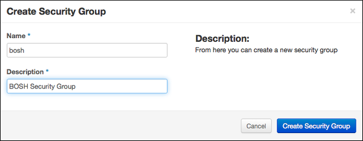
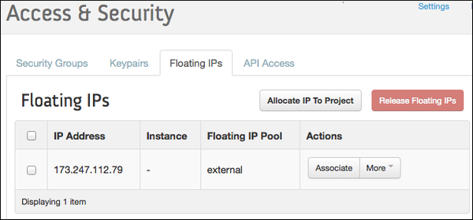

This document shows how to initialize new [environment](terminology.md#environment) on OpenStack.

## Step 1: Prepare an OpenStack environment {: #prepare-openstack }

### Prerequisites {: #prerequisites }

1. An OpenStack environment running one of the following supported releases:
    * [Liberty](http://www.openstack.org/software/liberty) (actively tested)
    * [Mitaka](http://www.openstack.org/software/mitaka) (actively tested)
    * [Newton](http://www.openstack.org/software/newton) (actively tested)

    !!! tip
        Juno has a [bug](https://bugs.launchpad.net/nova/+bug/1396854) that prevents BOSH to assign specific IPs to VMs. You have to apply a Nova patch to avoid this problem.

1. The following OpenStack services:
    * [Identity](https://www.openstack.org/software/releases/ocata/components/keystone):
        BOSH authenticates credentials and retrieves the endpoint URLs for other OpenStack services.
    * [Compute](https://www.openstack.org/software/releases/ocata/components/nova):
        BOSH boots new VMs, assigns floating IPs to VMs, and creates and attaches volumes to VMs.
    * [Image](https://www.openstack.org/software/releases/ocata/components/glance):
        BOSH stores stemcells using the Image service.
    * **(Optional)** [OpenStack Networking](https://www.openstack.org/software/releases/ocata/components/neutron):
        Provides network scaling and automated management functions that are useful when deploying complex distributed systems. **Note:** OpenStack networking is used as default as of v28 of the OpenStack CPI. To disable the use of the OpenStack Networking project, see [using nova-networking](openstack-nova-networking.md).

1. Access to an existing OpenStack project.

1. The following OpenStack networks:
    * An external network with a subnet, that can assign a floating IP.
    * A private network with a subnet. The subnet must have an IP address allocation pool. Will be created by Terraform automatically.

1. OpenStack flavor `m1.xlarge`
    The flavor is hard coded in `bosh-deployment/openstack/cpi.yml`.

1. A security group, optionally created via terraform, that allows communication to the director and BOSH traffic within the group. With the `create-env` command described below, this security group is used for the BOSH VM itself and is the default for all VMs deployed by BOSH. If you want to use separate security groups for deployments, overwrite the default in the `cloud_properties` section of the [cloud config](https://bosh.io/docs/openstack-cpi/).

### Configuration of a new OpenStack Project

#### Automated Configuration

You can use a [Terraform environment template](https://github.com/cloudfoundry-incubator/bosh-openstack-environment-templates/tree/master/bosh-init-tf) to configure your OpenStack project.

You will need to create a `terraform.tfvars` file with information about the environment.
Applying the Terraform plan to the environment will output the variables necessary for ["Step 2: Deploy"](#deploy).

#### Manual Configuration

!!! note
    See the [OpenStack documentation](http://docs.openstack.org/) for help finding more information.

Instead of using Terraform, you can do the following things manually as described below:

* Create a [Keypair](#keypair).
* Create and configure [Security Groups](#security-groups).
* Allocate a [floating IP address](#floating-ip).

---
##### Create a Keypair {: #keypair }

1. Select **Access & Security** from the left navigation panel.

1. Select the **Keypairs** tab.

    

1. Click **Create Keypair**.

1. Name the keypair "bosh" and click **Create Keypair**.

    

1. Save the `bosh.pem` file to `~/Downloads/bosh.pem`.

    

---
##### Create and Configure BOSH Security Group {: #security-groups }

You must create and configure a security group to restrict incoming network traffic to the BOSH VMs.

1. Select **Access & Security** from the left navigation panel.

1. Select the **Security Groups** tab.

    

1. Click **Create Security Group**.

1. Name the security group "bosh" and add the description "BOSH Security Group"

    

1. Click **Create Security Group**.

1. Select the BOSH Security Group and click **Edit Rules**.

1. Click **Add Rule**.

    

1. Add the following rules to the BOSH Security Group:

    !!! warning
        It highly discouraged to run any production environment with `0.0.0.0/0` source or to make any BOSH management ports publicly accessible.

    <table border="1" class="nice" >
      <tr>
        <th>Direction</th>
        <th>Ether Type</th>
        <th>IP Protocol</th>
        <th>Port Range</th>
        <th>Remote</th>
        <th>Purpose</th>
      </tr>

      <tr><td>Ingress</td><td>IPv4</td><td>TCP</td><td>22</td><td>0.0.0.0/0 (CIDR)</td><td>SSH access from CLI</td></tr>
      <tr><td>Ingress</td><td>IPv4</td><td>TCP</td><td>6868</td><td>0.0.0.0/0 (CIDR)</td><td>BOSH Agent access from CLI</td></tr>
      <tr><td>Ingress</td><td>IPv4</td><td>TCP</td><td>25555</td><td>0.0.0.0/0 (CIDR)</td><td>BOSH Director access from CLI</td></tr>

      <tr><td>Egress</td><td>IPv4</td><td>Any</td><td>-</td><td>0.0.0.0/0 (CIDR)</td></tr>
      <tr><td>Egress</td><td>IPv6</td><td>Any</td><td>-</td><td>::/0 (CIDR)</td></tr>

      <tr><td>Ingress</td><td>IPv4</td><td>TCP</td><td>1-65535</td><td>bosh</td><td>Management and data access</td></tr>
    </table>

---
##### Allocate a Floating IP Address {: #floating-ip }

1. Select **Access & Security** from the left navigation panel.

1. Select the **Floating IPs** tab.

    

1. Click **Allocate IP to Project**.

1. Select **External** from the **Pool** dropdown menu.

1. Click **Allocate IP**.

    

1. Replace `FLOATING-IP` in your deployment manifest with the allocated Floating IP Address.

    

---
## Step 2: Deploy {: #deploy }

### Prerequisites

Install [CLI v2](cli-v2.md).

### Collect Configuration Variables

Put all the configuration variables into a YAML file `vars.yml`. Alternatively you can pass them to `create-env` via separate `-v` switches on the [command line](#create-env).

```yaml
---
director_name: bosh-1
internal_cidr: 10.0.1.0/24
internal_gw: 10.0.1.1
internal_ip: 10.0.1.10
auth_url: https://example.com:5000/v3
az: nova
default_key_name: microbosh
default_security_groups: [bosh]
net_id: <NET_ID>
openstack_domain: Default
openstack_username: <USERNAME>
openstack_password: <PASSWORD>
openstack_project: <PROJECT>
region: CustomRegion
```

We omit the `private_key` from the configuration file, so we don't have to escape multi-line strings in YAML.
Loading it directly from a file with `--var-file`, when deploying, will keep it intact.

The `external_ip` is only required for the `external-ip-with-registry-not-recommended.yml` ops file.

!!! warning
    Do not commit `vars.yml` into public version control as it contains credentials. You could separate those into a second YAML file, i.e. `creds.yml`, and load both when deploying.

#### From Terraform

If you used Terraform as described in [prerequisites](#prerequisites) you can use the output of `terraform apply` to build the configuration file.

The variable names from the Terraform output match those in the `vars.yml`.
Here is an example of the Terraform output section:

```
default_key_name = bosh-1
default_security_groups = [bosh]
external_ip = 192.168.1.19
internal_cidr = 10.0.1.0/24
internal_gw = 10.0.1.1
internal_ip = 10.0.1.10
net_dns = [172.1.0.1]
net_id = aaaaaaaa-d135-4d24-9b5a-aaaaaaaaaaaa
router_id = bbbbbbbb-80ad-4a43-8d04-bbbbbbbbbbbb
```

#### Manually

If you configured the environment manually, instead of using Terraform, downloading the RC file from OpenStack might help with figuring out the required values, like the `auth_url`, `region` and `openstack_domain`.

The `openstack_domain` is the [OpenStack domain](https://docs.openstack.org/security-guide/identity/domains.html) of the user account.

The `az` is probably just `nova`, you can use the OpenStack CLI to list available AZs: `openstack availability zone list`.

The `net_id` and `internal_cidr`, `internal_gw` and `internal_ip` variables belong to the private subnet mentioned in [prerequisites](#prerequisites).

The `default_key_name` matches the name of the SSH key for new VMs generated [above](#keypair).

The `default_security_groups` matches the name of the group created for bosh [above](#security-groups).

The `external_ip` was acquired by [allocating a floating IP](#floating-ip) earlier in this documentation.

### Deploy the Director {: #create-env }

Use `bosh create-env` command to deploy the Director.

```shell
# Create directory to keep state
$ mkdir bosh-1 && cd bosh-1

# Clone Director templates
$ git clone https://github.com/cloudfoundry/bosh-deployment

# Copy the `bosh.pem` generated earlier here
$ cp ~/Downloads/bosh.pem .

# Deploy the Director, all configuration variables are stored in `vars.yml`
$ bosh create-env bosh-deployment/bosh.yml \
    --state=bosh-state.json \
    --vars-store=director-creds.yml \
    --vars-file=vars.yml \
    -o bosh-deployment/openstack/cpi.yml \
    -o bosh-deployment/external-ip-with-registry-not-recommended.yml \
    --var-file=private_key=bosh.pem
```

If running above commands inside of an OpenStack network, i.e. if the `bosh` CLI is installed on a jump host, we can omit the `external-ip-with-registry-not-recommended.yml` ops file and optionally remove `external_ip:` from the `vars.yml`. Then we would have to connect to the internal IP directly. Refer to [Exposing environment on a public IP](init-external-ip.md) for additional information.

!!! warning
    It highly discouraged to expose the BOSH directors management ports in an production environment.
    The default security group allows access to these ports.

The IP is used in generated SSL certificates, make sure to change or remove the `director-creds.yml` variable store after changing the IP to regenerate the certificates.

See [OpenStack CPI errors](openstack-cpi-errors.md) for list of common errors and resolutions.

#### Customize the Deployment

* using internal DNS, i.e. if it is required to resolve the OpenStack API endpoint: [bosh-deployment/misc/dns.yml](https://github.com/cloudfoundry/bosh-deployment/blob/master/misc/dns.yml)
* using `boot-from-volume` to have nova create the boot volume as a cinder device (necessary for live-migration of VMs): [bosh-deployment/openstack/boot-from-volume.yml](https://github.com/cloudfoundry/bosh-deployment/blob/master/openstack/boot-from-volume.yml)
* using a custom CA for your OpenStack endpoints: [bosh-deployment/openstack/custom-ca.yml](https://github.com/cloudfoundry/bosh-deployment/blob/master/openstack/custom-ca.yml)
* putting additional trusted certificates into the cert-store of deployed VMs: [bosh-deployment/openstack/trusted-certs.yml](https://github.com/cloudfoundry/bosh-deployment/blob/master/openstack/trusted-certs.yml)
* using a custom ntp server for deployed VMs: [bosh-deployment/misc/ntp.yml](https://github.com/cloudfoundry/bosh-deployment/blob/master/misc/ntp.yml)
* using keystone v2 instead of keystone v3: [bosh-deployment/openstack/keystone-v2.yml](https://github.com/cloudfoundry/bosh-deployment/blob/master/openstack/keystone-v2.yml)
* enable soft anti affinity for each instance group: [bosh-deployment/openstack/auto-anti-affinity.yml](https://github.com/cloudfoundry/bosh-deployment/blob/master/openstack/auto-anti-affinity.yml)
* disable human readable VM names and use UUIDs instead: [bosh-deployment/openstack/disable-readable-vm-names.yml](https://github.com/cloudfoundry/bosh-deployment/blob/master/openstack/disable-readable-vm-names.yml)

### Connect to the Director

```shell
# Configure local alias
$ bosh alias-env bosh-1 -e 192.168.1.19 --ca-cert <(bosh int ./director-creds.yml --path /director_ssl/ca)

# Log in to the Director
$ export BOSH_CLIENT=admin
$ export BOSH_CLIENT_SECRET=`bosh int ./director-creds.yml --path /admin_password`

# Query the Director for more info
$ bosh -e bosh-1 env
```

Depending on previous choices you might have to use the internal IP instead of `external_ip`.

Instead of using `alias-env` and `-e`, you can set the environment variable `BOSH_ENVIRONMENT` to the IP of your director:

```shell
export BOSH_ENVIRONMENT=`bosh int vars.yml --path /external_ip`
```

If you require a custom CA, set `BOSH_CA_CERT` too:

```shell
export BOSH_CA_CERT=`bosh int director-creds.yml --path /director_ssl/ca`
```

### Save Deployment State

Save the deployment state files left in your deployment directory `bosh-1` so you can later update/delete your Director. See [Deployment state](cli-envs.md#deployment-state) for details.

You always need the JSON state file, as it contains OpenStack IDs of most objects, like volumes and VMs.
However you don't need the actual manifest, as you can recreate it by by running `interpolate` instead of `create-env`:

```shell
# Deploy the Director, all configuration variables are stored in `vars.yml`
$ bosh interpolate bosh-deployment/bosh.yml \
    --vars-store=director-creds.yml \
    --vars-file=vars.yml \
    -o bosh-deployment/openstack/cpi.yml \
    -o bosh-deployment/external-ip-with-registry-not-recommended.yml \
    -v external_ip=FLOATING-IP \
    --var-file=private_key=bosh.pem | tee bosh.yml
```

### Update Cloud Config

Once the director is deployed, you probably want to upload a [cloud config](https://bosh.io/docs/cloud-config/) with IaaS specific configuration for your deployments. The `vars.yml` contains most values, except custom DNS, necessary to interpolate the cloud config from `bosh-deployment/openstack/cloud-config.yml`:

```shell
$ bosh update-cloud-config \
    --vars-file=vars.yml \
    bosh-deployment/openstack/cloud-config.yml
```
